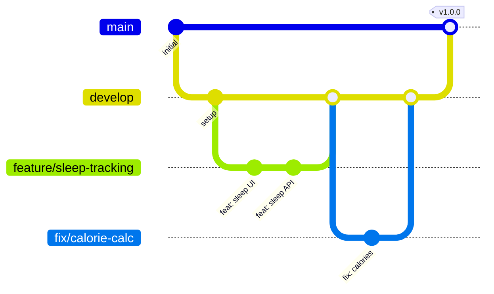

# 🤝 Guide de Contribution — HealthIAi

Merci de votre intérêt pour contribuer à **HealthIAi** ! 🎉
Ce guide vous accompagne pas à pas pour configurer votre environnement de développement et soumettre vos contributions.

---

## 1. 📋 Prérequis

Avant de commencer, assurez-vous d'avoir installé les outils suivants :

| Outil | Version minimale | Vérification |
|---|---|---|
| Python | 3.11+ | `python --version` |
| Node.js | 20+ | `node --version` |
| Docker | 24+ | `docker --version` |
| Docker Compose | 2.20+ | `docker compose version` |
| Git | 2.40+ | `git --version` |
| Expo CLI | Dernière version | `npx expo --version` |

> [!NOTE]
> Sur macOS, il est recommandé d'utiliser [Homebrew](https://brew.sh) pour installer Python et Node.js.
> Pour Node.js, vous pouvez aussi utiliser [nvm](https://github.com/nvm-sh/nvm) pour gérer plusieurs versions.

---

## 2. 🛠️ Installation de l'Environnement de Développement

### Étape 1 : Cloner le dépôt

```bash
# Fork le repo sur GitHub, puis clonez votre fork
git clone https://github.com/<votre-username>/HealthIAi.git
cd HealthIAi
```

### Étape 2 : Configurer le Backend

```bash
# Accéder au dossier backend
cd backend

# Créer un environnement virtuel Python
python -m venv venv

# Activer l'environnement virtuel
# macOS / Linux :
source venv/bin/activate
# Windows :
# venv\Scripts\activate

# Installer les dépendances
pip install -r requirements.txt
```

### Étape 3 : Configurer les variables d'environnement

```bash
# Copier le fichier d'exemple
cp .env.example .env

# Éditer le fichier .env avec vos valeurs
# ⚠️ Ne commitez JAMAIS le fichier .env !
```

> [!WARNING]
> Le fichier `.env` contient des clés API et des secrets sensibles.
> Il ne doit **jamais** être commité dans le dépôt Git. Vérifiez qu'il est bien dans le `.gitignore`.

### Étape 4 : Lancer les services Docker

```bash
# Revenir à la racine du projet
cd ..

# Lancer MySQL (et Redis si configuré) en arrière-plan
docker compose up -d
```

### Étape 5 : Lancer le Backend

```bash
cd backend

# Lancer le serveur de développement FastAPI
uvicorn main:app --reload --host 0.0.0.0 --port 8000
```

Le backend est maintenant accessible sur : `http://localhost:8000`
La documentation Swagger est disponible sur : `http://localhost:8000/docs`

### Étape 6 : Configurer et lancer le Frontend

```bash
cd frontend

# Installer les dépendances Node.js
npm install

# Lancer l'application Expo en mode développement
npx expo start
```

> [!TIP]
> Utilisez l'option `--tunnel` si vous testez sur un appareil physique sur un réseau différent :
> ```bash
> npx expo start --tunnel
> ```

### Résumé des ports

| Service | Port | URL |
|---|---|---|
| Backend FastAPI | 8000 | `http://localhost:8000` |
| Swagger UI | 8000 | `http://localhost:8000/docs` |
| Frontend Expo | 8081 | `http://localhost:8081` |
| MySQL | 3306 | `localhost:3306` |
| Redis *(prévu)* | 6379 | `localhost:6379` |

---

## 3. 📝 Conventions de Code

### Backend (Python)

#### Style et formatage
- **PEP 8** : Respecter les conventions de style Python
- **Longueur de ligne** : 88 caractères maximum (configuration Black)
- **Formatage automatique** : utiliser [Black](https://github.com/psf/black) et [isort](https://pycqa.github.io/isort/)

```bash
# Formatter le code
black .
isort .
```

#### Bonnes pratiques

- **Type hints obligatoires** pour toutes les fonctions :

```python
# ✅ Correct
def calculate_calories(weight: float, height: float, age: int) -> float:
    """Calcule les besoins caloriques journaliers."""
    return weight * 10 + height * 6.25 - age * 5

# ❌ Incorrect
def calculate_calories(weight, height, age):
    return weight * 10 + height * 6.25 - age * 5
```

- **Docstrings** pour toutes les fonctions publiques (format Google) :

```python
def analyze_meal(image_data: bytes, user_id: int) -> MealAnalysis:
    """Analyse une image de repas avec l'IA.

    Args:
        image_data: Données binaires de l'image du repas.
        user_id: Identifiant de l'utilisateur.

    Returns:
        MealAnalysis: Résultat de l'analyse nutritionnelle.

    Raises:
        AIServiceError: Si l'API IA est indisponible.
    """
```

- **Pydantic** pour la validation des données (modèles de requête et réponse)
- **Async/await** pour toutes les opérations I/O (base de données, appels API)

### Frontend (TypeScript)

#### Style et formatage
- **TypeScript strict mode** activé dans `tsconfig.json`
- **ESLint** avec la configuration Expo par défaut
- **Prettier** pour le formatage automatique

#### Conventions de nommage

| Élément | Convention | Exemple |
|---|---|---|
| Composants React | PascalCase | `MealTracker.tsx` |
| Fonctions utilitaires | camelCase | `calculateCalories()` |
| Fichiers | kebab-case | `meal-tracker.tsx` |
| Constantes | SCREAMING_SNAKE_CASE | `MAX_DAILY_CALORIES` |
| Types / Interfaces | PascalCase | `UserProfile` |
| Hooks personnalisés | camelCase avec préfixe `use` | `useMealData()` |

#### Bonnes pratiques

- **Composants fonctionnels** uniquement (pas de classes React)
- **Imports avec alias** `@/` pour le dossier `src/` :

```typescript
// ✅ Correct
import { MealCard } from '@/components/MealCard';
import { useAuth } from '@/hooks/useAuth';

// ❌ Incorrect
import { MealCard } from '../../../components/MealCard';
```

- **Typage explicite** des props et du state :

```typescript
// ✅ Correct
interface MealCardProps {
  meal: Meal;
  onDelete: (id: number) => void;
}

export function MealCard({ meal, onDelete }: MealCardProps) {
  // ...
}
```

- **AsyncStorage** pour la persistance locale des données mockées (cf. conventions du projet)

---

## 4. 🌿 Structure des Branches



| Branche | Objectif | Convention de nommage |
|---|---|---|
| `main` | Production stable, déploiements | — |
| `develop` | Développement actif, intégration | — |
| `feature/*` | Nouvelles fonctionnalités | `feature/nom-de-la-feature` |
| `fix/*` | Corrections de bugs | `fix/description-du-bug` |
| `docs/*` | Documentation uniquement | `docs/sujet-de-la-doc` |
| `refactor/*` | Refactoring sans changement fonctionnel | `refactor/description` |
| `test/*` | Ajout ou modification de tests | `test/description` |

> [!IMPORTANT]
> Toutes les branches doivent partir de `develop` (sauf hotfixes critiques qui partent de `main`).
> Ne poussez **jamais** directement sur `main` ou `develop`.

---

## 5. 🚀 Processus de Contribution

### Étape par étape


1. **Fork** le dépôt sur GitHub
2. **Créer une branche** à partir de `develop` :
   ```bash
   git checkout develop
   git pull origin develop
   git checkout -b feature/ma-nouvelle-feature
   ```
3. **Développer** votre fonctionnalité ou correction
4. **Tester** votre code (voir section [Tests](#6--tests))
5. **Commiter** avec des messages conventionnels (voir ci-dessous)
6. **Pousser** votre branche :
   ```bash
   git push origin feature/ma-nouvelle-feature
   ```
7. **Créer une Pull Request** vers `develop` sur GitHub
8. **Attendre la review** et répondre aux commentaires
9. **Merge** une fois approuvée ✅

### 📋 Messages de Commit (Conventional Commits)

Nous utilisons la spécification [Conventional Commits](https://www.conventionalcommits.org/fr/) :

```
<type>(<scope>): <description>

[corps optionnel]

[pied de page optionnel]
```

#### Types disponibles

| Type | Description | Exemple |
|---|---|---|
| `feat` | Nouvelle fonctionnalité | `feat(tracking): ajout du suivi de sommeil` |
| `fix` | Correction de bug | `fix(meals): correction du calcul des calories` |
| `docs` | Documentation uniquement | `docs: mise à jour du README` |
| `test` | Ajout ou modification de tests | `test(auth): ajout des tests pour auth_service` |
| `chore` | Maintenance, dépendances | `chore: mise à jour des dépendances` |
| `refactor` | Refactoring sans changement fonctionnel | `refactor(api): simplification du router AI` |
| `style` | Formatage, point-virgules, etc. | `style: formatage avec Black` |
| `perf` | Amélioration de performances | `perf(db): optimisation des requêtes SQL` |
| `ci` | Configuration CI/CD | `ci: ajout du workflow GitHub Actions` |

> [!TIP]
> Si votre commit introduit un **breaking change**, ajoutez un `!` après le type :
> ```
> feat(auth)!: migration vers JWT RS256
> ```

---

## 6. 🧪 Tests

### Backend

```bash
cd backend

# Lancer tous les tests
pytest tests/ -v

# Lancer les tests avec couverture de code
pytest tests/ -v --cov=. --cov-report=html

# Lancer un fichier de test spécifique
pytest tests/test_auth.py -v

# Lancer un test spécifique
pytest tests/test_auth.py::test_login_success -v
```

> [!NOTE]
> Le rapport de couverture HTML est généré dans `backend/htmlcov/index.html`.
> Ouvrez-le dans votre navigateur pour visualiser la couverture ligne par ligne.

#### Structure des tests backend

```
backend/tests/
├── test_auth.py          # Tests d'authentification
├── test_ai_service.py    # Tests du service IA
├── test_tracking.py      # Tests du suivi nutritionnel
├── test_progress.py      # Tests des progrès
├── conftest.py           # Fixtures partagées
└── mock_data/            # Données de test
```

### Frontend

```bash
cd frontend

# Lancer le linter
npx expo lint

# Vérifier les types TypeScript
npx tsc --noEmit

# Lancer les tests (si configurés)
npm test
```

### Écrire de bons tests

- **Un test = un comportement** : chaque test vérifie une seule chose
- **Noms descriptifs** : le nom du test décrit le comportement attendu
- **AAA** : Arrange, Act, Assert

```python
# ✅ Bon test
async def test_login_with_valid_credentials_returns_token():
    # Arrange
    user = await create_test_user(email="test@example.com", password="secure123")

    # Act
    response = await client.post("/auth/login", data={
        "username": "test@example.com",
        "password": "secure123",
    })

    # Assert
    assert response.status_code == 200
    assert "access_token" in response.json()
```

---

## 7. 🔍 Processus de Review

### Critères d'acceptation d'une Pull Request

| Critère | Requis | Description |
|---|---|---|
| ✅ Review approuvée | Oui | Au moins **1 review** d'un mainteneur |
| ✅ Tests passent | Oui | Tous les tests CI doivent être verts |
| ✅ Pas de conflits | Oui | La branche doit être à jour avec `develop` |
| ✅ Code documenté | Oui | Docstrings, commentaires si nécessaire |
| ✅ Conventions respectées | Oui | Lint, formatage, nommage |
| 🟡 Tests ajoutés | Recommandé | Couvrir les nouveaux comportements |
| 🟡 Changelog mis à jour | Recommandé | Pour les features et breaking changes |

### Checklist pour les reviewers

- [ ] Le code est lisible et compréhensible
- [ ] Les type hints sont présents (Python) / le typage est correct (TypeScript)
- [ ] Les cas d'erreur sont gérés
- [ ] Pas de données sensibles (clés, mots de passe) dans le code
- [ ] Les performances sont acceptables
- [ ] La sécurité est préservée (pas de nouvelles vulnérabilités)

### Résolution des conflits

```bash
# Mettre à jour votre branche avec develop
git checkout develop
git pull origin develop
git checkout feature/ma-feature
git rebase develop

# Résoudre les conflits si nécessaire, puis
git push --force-with-lease origin feature/ma-feature
```

> [!TIP]
> Utilisez `--force-with-lease` au lieu de `--force` pour éviter d'écraser le travail d'autres personnes.

---

## 8. 💬 Communication

- **Issues GitHub** : Pour signaler des bugs ou proposer des fonctionnalités
- **Pull Requests** : Pour les discussions techniques sur le code
- **Discussions GitHub** : Pour les questions générales et les idées

### Templates utiles

#### Bug Report

```markdown
## 🐛 Description du bug
[Description claire et concise]

## Étapes pour reproduire
1. Aller sur '...'
2. Cliquer sur '...'
3. Voir l'erreur

## Comportement attendu
[Ce qui devrait se passer]

## Captures d'écran
[Si applicable]

## Environnement
- OS : [ex. macOS 15.1]
- Node.js : [ex. 20.11]
- Python : [ex. 3.11.7]
```

#### Feature Request

```markdown
## 🚀 Description de la fonctionnalité
[Description claire de la fonctionnalité souhaitée]

## Motivation
[Pourquoi cette fonctionnalité serait utile ?]

## Solution proposée
[Comment imaginez-vous cette fonctionnalité ?]

## Alternatives considérées
[Autres approches possibles]
```

---

> [!NOTE]
> Ce guide est un document vivant. N'hésitez pas à proposer des améliorations
> via une Pull Request sur la branche `docs/*`.
>
> **Dernière mise à jour** : 17 juin 2026

Merci pour votre contribution ! 🙏
